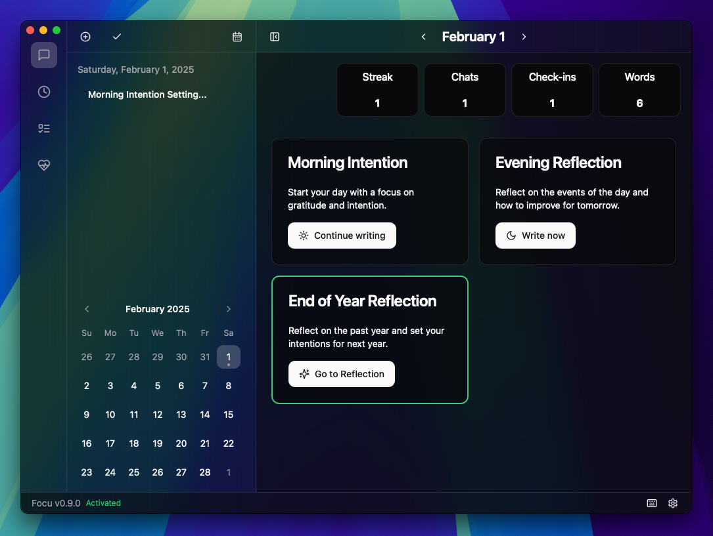

# Focu 

Open source mindful productivity app for macOS. You can find more information at [Focu.app](https://focu.app).

> Focu is currently in active development, functionality is subject to change.

## Why Focu?

Productivity is more than just getting things done, improve your daily routine, take care of your wellbeing, and reflect on your day.

Privacy is important, which is why Focu uses a locally running AI to help you reflect, plan, and focus. Your data never leaves your device and stays yours.

## Monorepo

Focu uses [Turbo](https://turbo.build/) to manage the monorepo structure.

- `apps/desktop`: The desktop app. Built with [Tauri](https://tauri.app/) and [NextJS](https://nextjs.org/). Embeds [Ollama](https://ollama.com/) to run the AI locally.
- `apps/landing-page`: The landing page. Built with [NextJS](https://nextjs.org/).
- `packages/ui`: The UI library. Mostly ReactJS, [Shadcn UI](https://ui.shadcn.com/) and some [Tremor components](https://tremor.so/).

## Contributing

See [CONTRIBUTING.md](CONTRIBUTING.md) for more information. This document is a work in progress.
